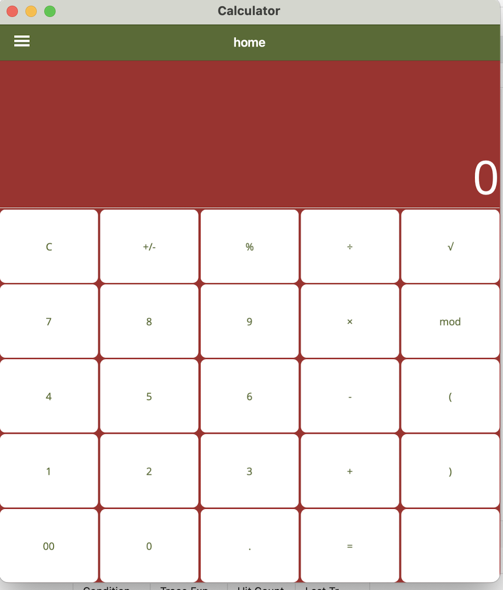
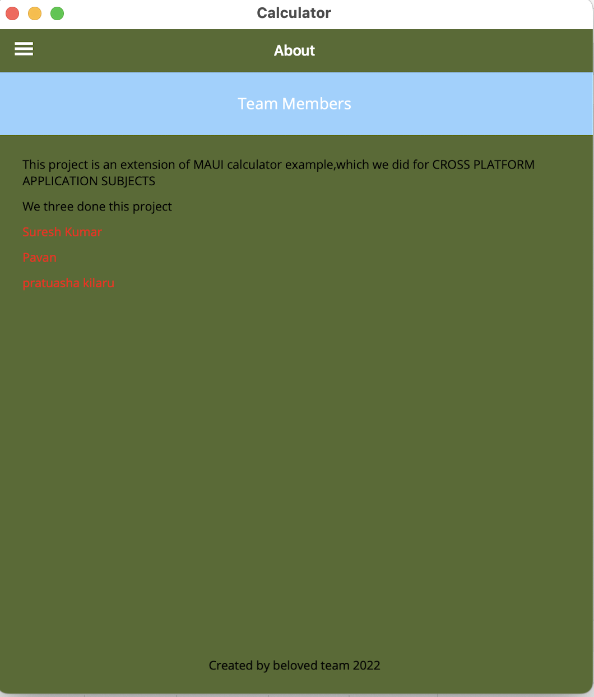

# Calculator Sample App

This basic calculator demonstrates using span and spacing features of a Grid layout to achieve a familiar interface.

For more information, see the [Grid documentation](https://docs.microsoft.com/dotnet/maui/user-interface/layouts/grid).

<!-- Collaborators  -->
## Collaborators 

We are team of three(Suresh kumar, Pavan Patibandla, Prathyusha Kilarul)

Suresh Kumar:
     Major commits: 1)UI buttons were added to MainPage.XAML.
                    2)for those new buttons in MainPage.XAML.CS, backend logic was developed.    
                     3)change styles.xaml for a better look.
Pavan:
     Major commits: 1)modified UI button designs layouts
                    2)added AppShell.xaml 
                    3)AppShell.xaml.cs for sidenav
Prathyusha:
     Major commits: 1)Created About.xaml
                    2)About.xaml.cs for about page
                    3)Did connection routes with previous pages.

    
     

(<a href="#readme-top">back to top</a>)

